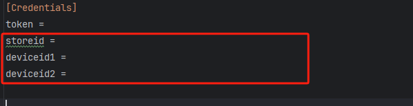
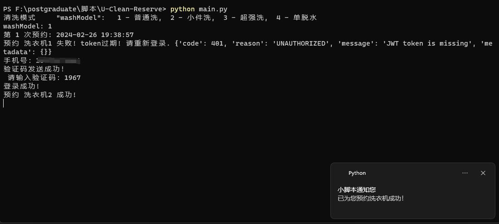

# U-Clean-Reserve

U净洗衣机下单脚本

## 实现功能

1. 循环间隔下单指定洗衣机，直至洗衣机空闲下单成功，通知并播放王心凌爱你~

## 编写该脚本原因

1. 宿舍洗衣机数量楼层分配不均。如1楼12台，而8楼仅有2台。
2. U净APP只能通过 **扫描洗衣机二维码进行下单** 或 **线上下单随机分配洗衣机** 。

如此一来我想使用洗衣机只能去洗衣房查看这2台洗衣机是否有空闲，或者随机分配的洗衣机是否为8层洗衣机。

遂无奈编写该脚本。

## 使用该脚本

1. 复制 `config_example.ini` 为 `config.ini`
2. 抓包查看你想抢占的楼栋id与洗衣机id，并写入 `config.ini`。
   抓包软件：**Fiddler**，教程自行查阅。
   
3. 运行 `main.py`

## 效果演示



## 主要参数

```
"""
洗衣机楼栋   "storeId": ""
洗衣机机号   "deviceId":  ""
机型        "deviceTypeId":   2 - 滚筒,  10 - 烘干机
清洗模式     "deviceWashModelId":    1 - 普通洗,  2 - 小件洗, 3 - 超强洗,  4 - 单脱水
温度        "washTemperatureId"：1 - 常温(实际30度高温),  2 - 30度, 3 - 40度, 4 - 60度
洗衣液      "wp_detergentGearId": 1 - 标准量,  3 - 大量
除菌液      "wp_disinfectantGearId":  4 - 标准量, 6 - 大量
"""
```

## 存在问题

抢占下单之后到了洗衣房，发现有哥们一直在等洗衣机空闲然而被我抢先下单了，些许尴尬，只能让给等待已久的哥们。

## 可拓展方向

1. **空闲洗衣机监听**。监听洗衣机是否空闲即可，不抢占下单（Fiddler抓包看看是哪个接口即可）
2. **楼栋id、洗衣机id获取**。通过提供的洗衣机二维码图片获取id（Fiddler抓包看看是哪个接口即可）
3. **web界面操作**
4. **邮件通知下单成功**