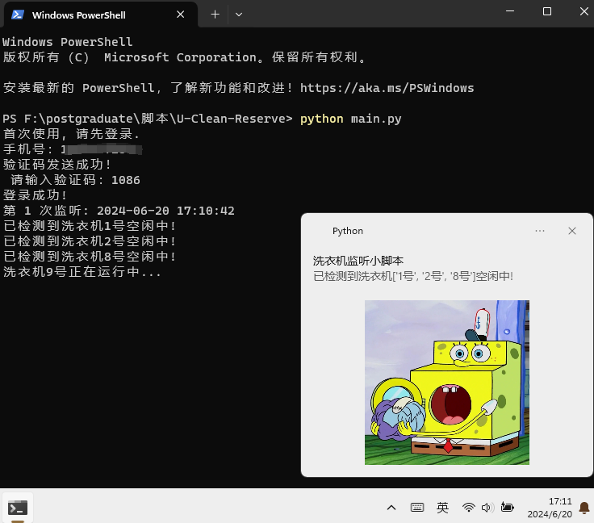
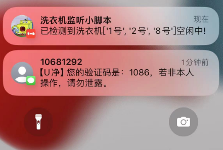

# U-Clean-Reserve

U净洗衣机监听脚本

## 实现功能

1. 循环间隔监听洗衣机运行状态，直至洗衣机空闲，通知并播放王心凌爱你~

## 快速上手

### 安装环境

```
pip install -r requirements.txt
```

### 上传洗衣机二维码图片

> 上传洗衣机二维码图片至 `washerQrCode_Figs` 文件夹，图片名称即为洗衣机名称


### 运行代码

```
python main.py
```

## 效果演示

### Windows



### iPhone - Bark



## 运行中可能遇到的问题

1. 解析二维码报错缺失 `libzbar-64.dll`，请参考 [解决方案](https://blog.csdn.net/weixin_42538848/article/details/135953702)
1. 调用playsound时报错：指定的设备未打开,或不被 MCI 所识别, 请参考 [解决方案](https://blog.csdn.net/qq_52385631/article/details/129563991)
2. 想使用 [Bark](https://github.com/Finb/Bark) ? 请复制你个人 `URL` 至 `config.json` 中 `bark_url` 位置，即完成
   

## 未来可能会拓展

1. Web界面操作，手机也可以开启监听